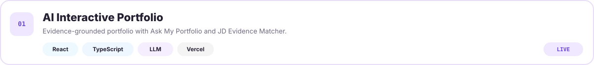
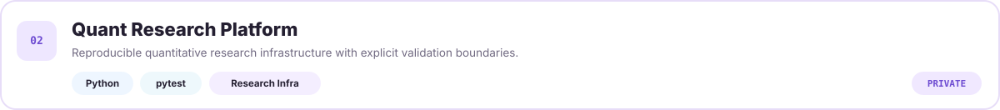
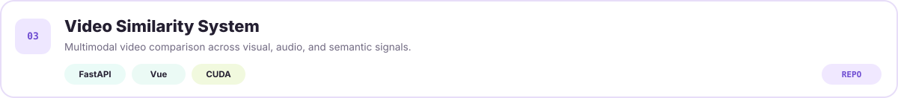
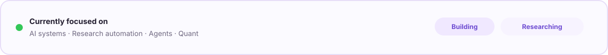

<div align="center">

# Hi, I'm Terry Lu 👋

### Software Engineer · AI/LLM · Research Systems


<sub>I build reliable software across backend engineering, AI systems, and research infrastructure.</sub>

</div>

---

## 👤 About Me

```yaml
name: Terry Lu
role: Software Engineer
location: New Taipei City, Taiwan
interests: [Python, AI/LLM, RAG, Research Infrastructure, Automation]
currently: Building reliable systems and research infrastructure
```

- Building evidence-grounded AI/LLM systems and practical software.
- Interested in reproducible research infrastructure, automation, and agent workflows.
- I like turning messy ideas into systems that can actually be tested and maintained.

---

## 🧰 Tech Stack

**Languages**  


**AI / Backend**  


**Infrastructure / Delivery**  


**Frontend**  


---

## ⭐ Featured Projects

<a href="https://ai-interactive-portfolio-woad.vercel.app/"></a>

<br />



<br />

<a href="https://github.com/terrylu930119/video_similarity_project"></a>

---

## 🖥️ Project Showcase


---

## ⚡ Live Status



<div align="center">
<sub>Open to Software Engineering &amp; AI Engineering opportunities.</sub>
</div>
