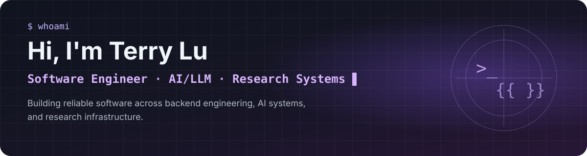

<!-- Archived profile README v2 — 2026-09-15 -->

<div align="center">



<br />

[](https://ai-interactive-portfolio-woad.vercel.app/)
[](https://github.com/terrylu930119?tab=repositories)


</div>

---

## Developer Toolkit

**CORE**  


**AI / LLM**  


**INFRA / DELIVERY**  


---

## Selected Work

### `01` AI Interactive Portfolio
Evidence-grounded portfolio with **Ask My Portfolio** and **JD Evidence Matcher**.  
`React` `TypeScript` `LLM` `Vercel`  
[**Live ↗**](https://ai-interactive-portfolio-woad.vercel.app/)

### `02` Quant Research Platform
Reproducible quantitative research infrastructure with explicit validation boundaries.  
`Python` `pytest` `Research Infrastructure`  
**Private**

### `03` Video Similarity System
Multimodal video comparison across visual, audio, and semantic signals.  
`FastAPI` `Vue` `CUDA`  
[**Repo ↗**](https://github.com/terrylu930119/video_similarity_project)

<div align="center">

[**Explore more → Repositories**](https://github.com/terrylu930119?tab=repositories) · [**Portfolio**](https://ai-interactive-portfolio-woad.vercel.app/)

</div>

---

## Live Status

```text
status = "building reliable systems"
focus  = "AI · research automation · agents"
```

---

<div align="center">

**Open to Software Engineering & AI Engineering opportunities.**

New Taipei City, Taiwan

</div>
